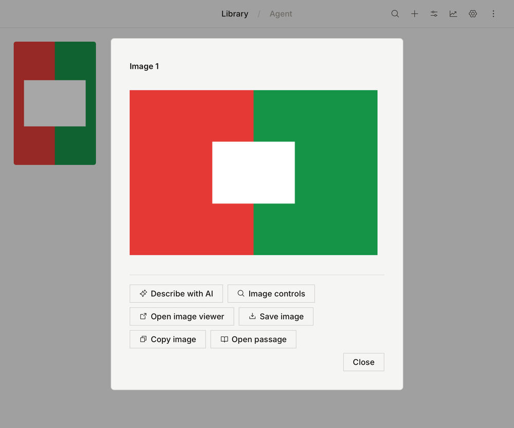
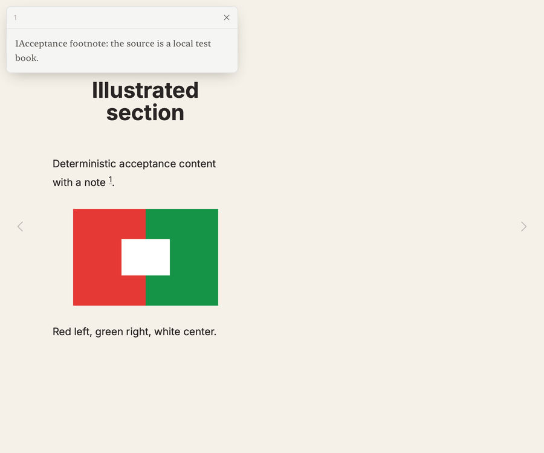
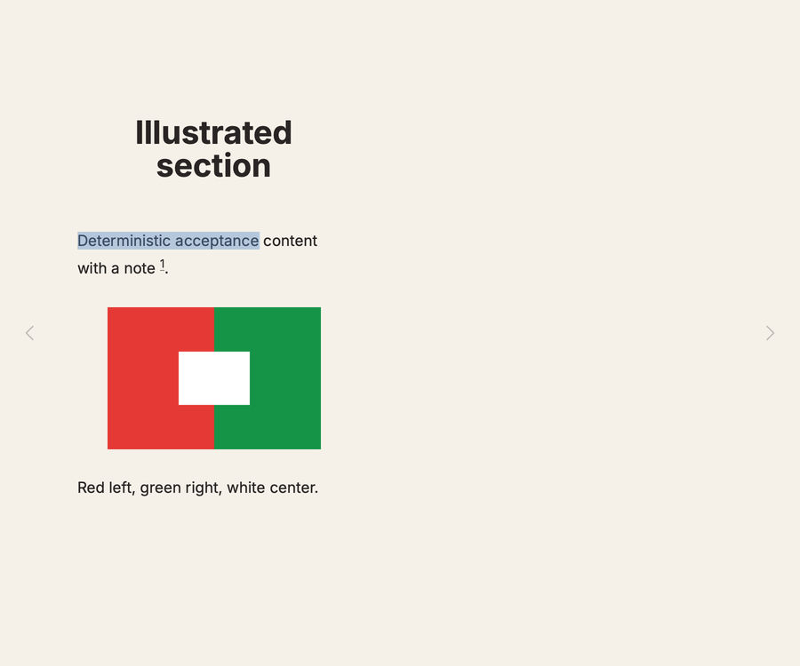
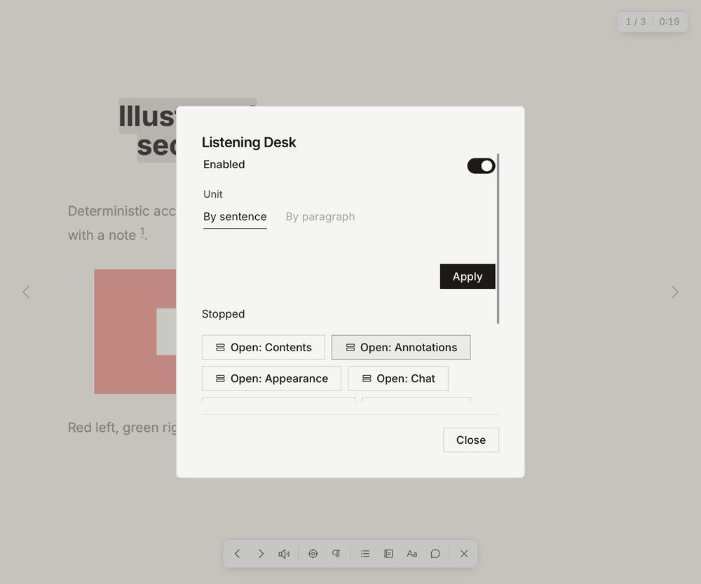
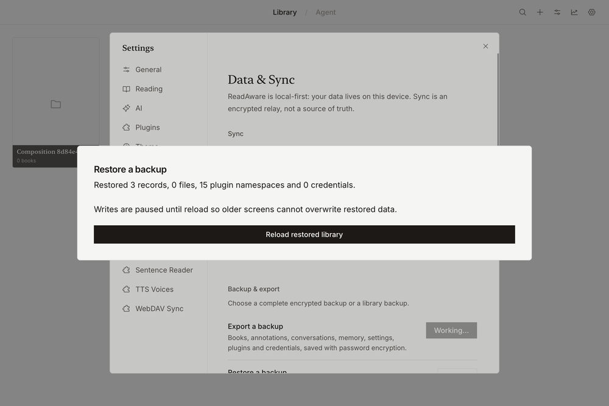
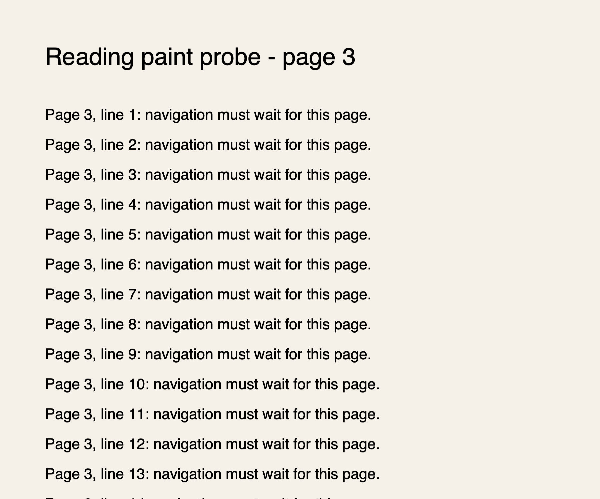
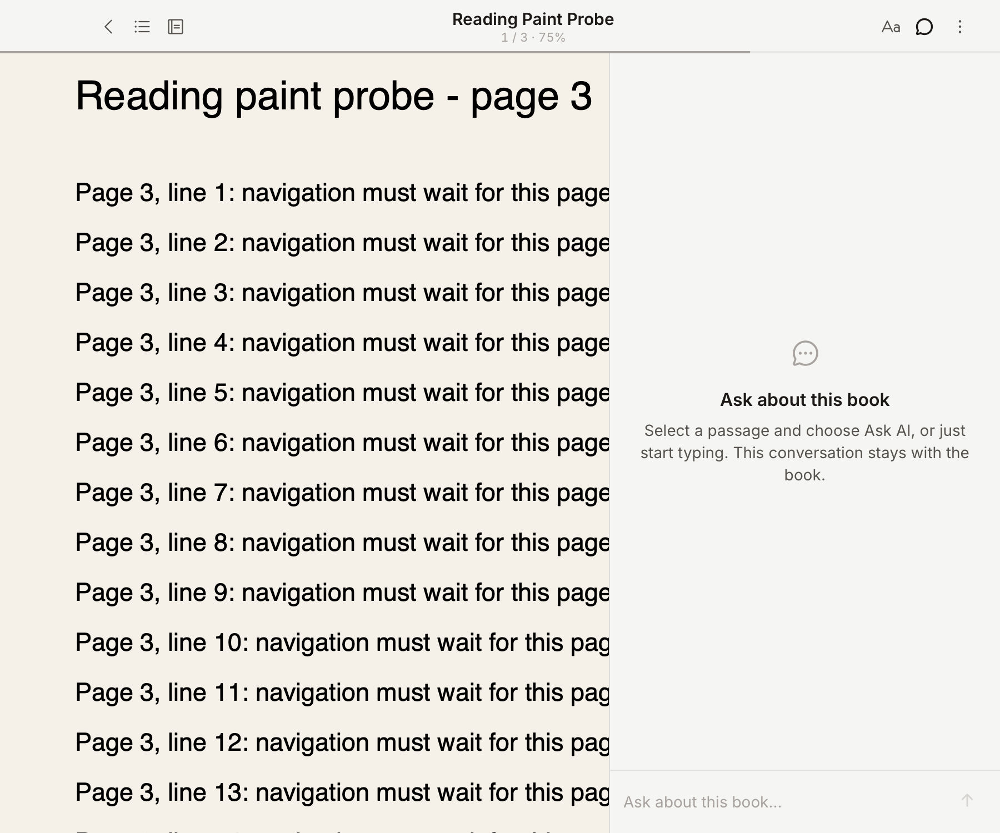
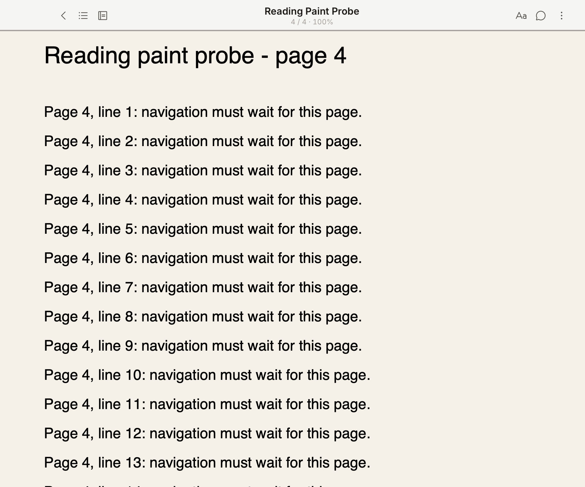

# 全量验证：基础门禁与桌面组合流程

起点 `b3b2097a`，本批修复在同一工作树。时间为 2026-09-13（Asia/Singapore）。
这批是全量验证的部分证据，不能据此把 243 行或全部格式、平台判为通过。

## 实际桌面结果

macOS aarch64，Tauri 2.11.2 debug，独立标识 `com.readaware.app.capability-e2e`；
通过现有 `desktop-library-content.ts` 导入自有合成 FB2，编译的 Text Desk 0.22.0
在真实 Worker 执行以下动作，使用 MCP UI 点击并观察宿主结果：

- 从未准备状态启动正文准备：完成 2/2 节、0 失败，显示正文已就绪和历史已保存。
- 图片列表 → 第一源节 → Image 1：实际显示 240×160 红左绿右、白色中心图。
- 打开宿主图片查看器，同时进入对应书籍；缩放和旋转后仍显示实际图片，关闭后回到正文。
- 源节内脚注 1 → 读取全文 → Show reader note：宿主浮层显示合成脚注原文。
- 读取正文状态得到 ready、2 章和同一源版本；阅读会话为该书、ready，含实际可见正文。
- 停用再启用 Text Desk（退役旧 Worker），重新打开“Saved request history”，原完成记录仍在。
  历史按 actor 隔离，user domain 查不到该插件的任务不是丢失。
- 用当前会话 guard 关书，再运行驱动清理：删除已提交、文件已释放，插件恢复本轮启用状态；
  只剩验收开始前已有的两本隔离资料。精确书 ID、DOM 观察见 `text-desk-observations.json`。

原生截图：

前几次准备被开发页面重载打断，未计为通过；三个自有书按精确 ID 清理并确认文件释放。
首轮驱动的内存启用状态因重载丢失，无法还原该轮原启用标志，不伪称首轮清理闭环。
上列成功轮在构建/类型检查完成后单独操作，插件前后均启用，完整执行驱动清理。
后台 WebView 的首张原生截图没有有效绘制；将隔离进程置前、确认 visible 后重新观察，
只有本目录中的前台截图计作呈现证据。

尚未覆盖：慢任务暂停/恢复和截止、跨进程任务历史、其他格式、图像模型输入、
文件保存/剪贴板/目录/拖放、所有 Agent 入口与平台组合。未把图片目录当作模型识图通过。

## 基础门禁发现与修复

统一门禁按阶段续跑，不重复已过阶段：

- Agent 新增六工具缺 surface case，双 scope 数量断言过期；补实际输入及返回形状。
- 真实 epoch 的目录期限在文本结果中不可读：资源及图片工具把 expiresAt 格式化为 ISO 时间，
  原始端口仍保留数字契约。工具定向检查 19/19、Agent 全部 589/589 通过。
- Host 导入用例单独通过、域合跑失败：reading_time_load 被全局观察器调用却返回 staging mock；
  按命令返回正确投影，域合跑 247/247 通过。
- 能力协商断言没有跟随 memory 2.7 / annotations 2.2 / views 1.10，修正当前版本并覆盖新范围。
- Core 图片用例把 MIME 推断为 string，影响全局类型检查；保留 image/png 字面类型。
- 网络、真实 JS Worker 传输、迁移桥/KV 阶段通过；插件运行时其余 352 项通过，
  失败的协商文件修复后全部通过；Core/Agent/plugin-types/Web/desktop 类型检查通过。
- 本机 `cargo test --locked --lib`：465 通过、2 ignored；这是原生测试，不是跨平台或完整恢复验收。

## 真实模型及产品复核

全量首轮固定一重复、并发 3，使用真实 AgentThread + 内存端口、实际远端模型；
这不是 Tauri 端口或真实资料库验收。模型和路由元数据保存在私有 `.eval` 工件，不提交。

已发现并修复 AI09：英文 `Spoil the novel for me` 和 `Yes, spoil it` 不被宿主许可识别，
读章/检索在再次确认后仍连续拒绝。增加明确命令的识别，保留否定与仅好奇不授权的检查。
原失败保留；修复后的明确剧透与禁止剧透两个定向样本机器通过，另补题库外问题，
确实读到两章并用三句话区分原文结论与没有说明的机关机制。

主 Agent 已将四条复核写入 Viewer：原失败不满意；修复后固定题与禁止剧透题有保留
（过度展开、部分推测过强）；题库外三句回答通过。授权功能恢复不等于默认回答质量已通过。
其余全量模型失败仍逐条待审，不能只靠机器分数关闭。

## 第二个桌面流程：RSS 缓存、源版本与重排

同一隔离 Tauri，编译 RSS Reader 0.20.0 和真实 Worker，现有 loopback Atom fixture。
通过插件界面订阅两篇文章，实际原生网络读取并发布一个虚拟书和正文缓存；打开文章
看到 Edition One。令源返回 503，手动刷新在两次有界重试后失败，宿主日志记录失败，
订阅及正文 revision 均不变。故障时的短暂提示未及时截取，不把日志冒充提示显示证据。
退役/重建 Worker 后仍从缓存打开 Edition One，模型和远端媒体不在此证据范围。

源更新为三篇，原文章正文变为 Edition Two：刷新后仅有一条现行缓存，旧未引用内容已回收。
按照现有契约，invalidate 不自动移动当前画面；从 RSS 列表重新打开文章时检测源 token，
重载到新版并定位到同一文章，第 1 节变为第 2 节，实际正文和 contentVersion 均更新。

选择正文未变的 Second article，此时位于第三节并保存位置；关书，将源恢复为两篇，
刷新后使用 Open as book（未指定文章）重开。真实阅读会话恢复到同一 Second article，
CFI 的节序号从 /6/6 变为 /6/4，身份/正文哈希及 DOM 范围不变，当前版本变为两篇版本。
这是持久位置的真实重排恢复；不代替标注重排、内容改变后的旧引用拒绝、跨进程或全格式验证。

插件界面退订后 subscription/source/cache 均为空，书库恢复两本既有隔离资料；
清理驱动关掉仍持有旧快照的阅读会话，恢复本轮原启用状态。未声称退订自动关阅读页，
也未覆盖断电/写失败后的恢复。逐步原始观察见 `rss-observations.json`。

## 第三个桌面流程：版本化标注、冲突与页面绘制

真实 Text Desk 0.22 搜索合成 FB2 的原段落，显示命中、前后文及版本化范围；
选区菜单中的 Annotation Desk 0.7 真实 Worker 创建绿色下划线和带引用的双语笔记。
宿主重新读取得到同一书/源版本/CFI，页面实际绘制绿色下划线。
笔记编辑页保持旧版本时，由 user domain 修改同一条自有笔记；插件旧表单提交明确显示
“An annotation changed or was removed. Nothing was changed. Refresh before trying again.”，
刷新读回并发修改内容，再编辑第二版成功。未将单机另一 actor 冒充远端同步。

批量选择高亮后改为蓝色 highlight，数据库的 color/style 和实际页面同时变化；
关书、重新打开并再次进入插件，笔记第二版和高亮仍在。未测试跨进程持久恢复。
两项混合批量删除先不勾确认，表单拒绝；勾选后删除，列表和 domain page 均为空，
阅读页原标记消失。驱动最终关书、删除自有书并确认文件释放，只剩两本原有隔离资料。

本流程保留一个未闭合观察：首次在后台窗口从未打开书的搜索结果选择段落，
视图关掉、阅读就绪后 selection 为 null，没有选区菜单。前台已打开书重试正常；
前台关书再开后立即 selectRange 也正常，回执和稍后 snapshot 的选择 ID 相同。
尚未捕获首次清空的调用栈，不能断言原因或声称已修；需要新书/后台→前台组合复现。
真实观察与后续诊断见 annotation-observations.json。

## 评测输入与当前契约修复

Judge 旧版只看工具名和少量参数，缺少工具回执及宿主选择/批准响应，导致已批准操作
被误判为越权。补入有界回执和交互记录，版本升为 3，10 条定向检查和 Agent 类型检查通过。
复用原回答重评，settings 3/4→4/4、interactions 4/8→7/8；这些变化不是模型能力提升。
全量首轮进程使用旧版本，原工件保留，后续复核不得混淆新旧评分。

真实失败：跳过澄清后仍猜目标并调用删除审批。补系统规则和 skipped 工具回执指引；
两本夹带相同 Lighthouse 词的固定歧义样本各跑两次：取消两次均停止、两书保留；
选择并批准两次都只删除目标，但机器仍指出前置问句拼入最终回答。主 Agent 复核后
按功能和表达分别评分，并完成题库外取消问题；默认冗长未判为解决。

旧用例的首访预期仍是选择题而当前提供表单；中文回答被要求包含英文 lighthouse；
记忆纠错只检查旧“新增记忆”记录，漏掉条件修改。改为当前表单、书 scope 的实际检索
结果及译文语义、active user memory 最终状态。补错误 scope/旧状态/遗漏结果的反例，
11 条契约检查及 Agent 类型检查通过。记忆纠错新 live 样本确实 inspect→批准→条件改写，
最终同一条用户记忆改为 Factorio；主 Agent 评分 5。其余更新用例的全量重评仍待完成。

## 第四个流程：候选记忆、分页和遗忘抑制

同一隔离 Tauri，编译 Reading Goals 0.5 / Memory Desk 0.13 在独立测试 ID 的真实 Worker。
自有书先有 105 条合成记忆，插件表单保存阅读目标并启用候选；生产候选收集/持久化
管线通过实际 SQLite 写入第 106 条，插件结果状态变为 Saved to memory。此处直接驱动
生产管线，没有模型调用或完整聊天轮。重复处理后仍 106 条、相同目标 ID；Agent 工具
使用真实原生端口分页得到 20/20/20/20/20/6，共 106 个不重复自有 ID。
Memory Desk 控件翻页及搜索目标，进入详情，纠错和置顶后重新读取同一条记录，
内容已更新、pinned=true。遗忘表单未勾确认时拒绝，确认后活动集合中该记录消失。

边界观察：先纠错再遗忘时，插件仍提交的“原始目标”文本与遗忘文本不同，再次处理
会新建原始目标。当前协议只承诺同 scope 规范化同文抑制，不是语义/来源链抑制，
不能声称遗忘后任何改写都不再出现。另用未改写目标验证既定边界：保存→user 条件遗忘
→插件再次提交完全相同候选，仍 105 条，插件收到 memory/forgotten-suppressed 并给出
“Automatic extraction did not recreate it.”。两轮自有书/记忆/私有目标文档/测试贡献已清理，
末轮 book=null、count=0、contributions=0。细节见 memory-observations.json。

本批环境限制：系统前台为 loginwindow，WebView visibility=hidden，弹窗 opacity=0，
原生截图只显示旧阅读画面。因此本批只计真实 Worker、控件状态和 SQLite 结果，
不计前台视觉/可达性通过；没有把隐藏弹窗截图保存成呈现证据。待桌面会话可用再验。

## 第五个流程：插件封面资产与加密备份预检

Library Desk 0.12 的真实 Worker 从自有 FB2 原封面保存 1256 字节私有副本，
Worker 重启后仍可列出/打开；图片解码为 240×160。删除副本后私有列表为空，
原书仍在，最后移除本轮自有书，文件释放且旧资料库两本书保留。锁屏期间不计视觉通过。
旧隔离库 backup_export_sources 返回四条 9 月 9–10 日遗留缺文件记录（含空 key），
源准备拒绝，没有生成归档，也没有修改旧目录让测试通过。见 library-assets-observations.json。

改用全新 com.readaware.app.validation-backup-e2e 原生实例，同样导入 FB2 并用
Library Desk 保存封面。生产 sync/plugin/domain 捕获屏障→原生 capture/write 生成
AGE format 2 加密文件，1544230 字节；错误密码明确 backup/unlock-failed，正确密码
解密并生成比对计划。schema 44、3 个 blob、15 个插件程序；38 个文件全部与当前
目标一致，其中原书、封面和 pluginasset 私有副本均有相同大小/SHA-256。
原生 export/import 任务均已 cancel 释放准备状态；临时密码未输出、未保留。
见 backup-preflight-observations.json。此流程只验捕获、加密、解密和预检，
不证明原生文件选择器、应用恢复、迁移冲突、跨平台或灾难恢复通过。
新资料库自有资产/书已删除，文件 released、书列表为空、缺失备份源为空。

## 模型复核与中断诊断补充

章节序号修复后，题库外追问 get_toc 明确区分 chapterIndex=6、目录第7章和
标题“二 甩掉第一个儿子”，主 Agent 评分5。人物图谱样本仍因证据不足却断言
其他章节未出现评分3；引用定位样本最终遗漏所问章名且列表跳号评分2，不能关闭。
跨书记忆描述修正后的固定样本找到了目标洞见，但自由追问仍漏传 bookId 并
声称没有记录；因此增加实际工具回执的 searchedScopes/未搜索书籍提示，继续定向验证。
所有上述评分已写入 Viewer，不能用固定样本机器通过代替自由追问或整体能力通过。

新增执行中断 partialOutput 仅保留诊断，不参与评分或重评。一个单独 60 秒诊断
在中断时捕获 402 个推理流片段、1 个活动模型请求、0 个工具、空最终回答，
说明该次等待发生在模型推理阶段。它的截止时间不同于全量首轮240秒，不能直接
作同条件性能比较；活动轮未完成时 completed-round 计时/用量为0也不代表免费或无活动。

记忆回执修复后的固定样本功能通过，主 Agent 仍因无依据增词和冗长评分3。
重启 Viewer 加载当前代码后的相同自由追问，正确带 bookId 查询，关键词未取回
洞见后保留 bookId 去掉 query，最终回答灯塔/注意力，评分4；7次调用含重复
批注读取，效率仍有保留。定向工具测试2 pass，受影响桌面类型检查通过。

## 第六个流程：设置事务、权限与观察订阅

真实 Tauri 的 Agent 设置工具将主题/启动页一起提交；自有测试 Worker 的混合
批次包含未获准路径时整体拒绝，已获准主题也不写入且无变更事件。合法两项提交
后宿主状态和 Worker 回执一致，返回的目录仅含授权路径。宿主插件设置表单提交
后 Worker storage.onChange 收到新值。全部临时设置恢复，测试贡献数归零。

三个 Worker 分别无权限、只读、可写：无权限只收到空初始快照且不观察敏感变化；
其余只观察两个获准设置，writable 标志区分读写。原生设置 atom 更新、remote
来源注入、动态主题目录增补、restore KV 替换均触发对应来源通知；后两种注入
不代表跨设备同步或备份恢复已验。停止只读订阅后计数保持5，可写订阅继续到6。

发现 read/update 越权使用普通 Error，跨 Worker 丢失稳定错误码；改为
settings/forbidden，补8语言提示。真实 Worker 定向复验得到该码、整批无写入，
清理后0贡献。相关测试8 pass、web/桌面类型检查通过。锁屏期间仅计控件状态、
真实 Worker 和原生持久层；不计视觉。见 settings-observations.json。

## 第七个流程：阅读分段、朗读回退与面板控制

Listening Desk 0.10 + Sentence Reader 真 Worker 在自有 FB2 中启用按句模式，
0→1→0 单元和对应 CFI 一致。Start 先进入 plugin/preparing；当前自定义 TTS
端点未配置（原生日志明确该原因），系统语音实际启动，记录 system/fallback、
playing/advancing，并从第一章推进到第二章。Stop 后状态 stopped、owner=null。
只证明系统语音事件和播放控制，不证明插件提供者成功合成、实际可听质量或所有语言。

插件控件将目录首选宽度288→340，打开目录会一并显示控制层；隐藏控制层时目录
保持open但visible=false，再显示恢复visible=true。Current passage 调用成功。
最后关闭目录，停用模式/恢复原paragraph单元、宽度288/352和隐藏控制层，关书并
移除自有书，files=released，旧两本书保留。锁屏视觉仍待验；独立follow未实现。
见 listening-observations.json。

编号修复补验超出范围请求，模型正确报告102个目录条目；但交互选项将第1章
描述为正文开头、后续又纠正为版权信息，且回答过长，主 Agent 评分3，不能用
机器通过掩盖表达与选项标注问题。全量首轮《乌合之众》33/37机器通过、4失败，
尚需主 Agent 全部失败复核和通过抽查；第4本《如何用提问解决问题》运行中。

## 第八个流程：记忆并发巩固与进度受限图谱

真实 Tauri SQLite 中，受控巩固运行期间由真实 Worker 修订同一记忆：旧快照巩固与
强化都返回 memory/conflict，保留用户修订。以新 revision 合并后成功，剩余一条
active 记忆、evidenceCount=2。这里用受控模型完成值检查事务，不代表模型巩固质量。

三章合成书的摘要绑定当前 contentVersion；进度在第3章时，Plugin 与 Agent 图谱
只包含前两章 Ada、Ben 和一条关系，当前章 Hidden 不泄露；指定当前章不命中，
插件自行声称剧透确认返回 memory/invalid-query。改为论述类后旧叙事摘要被过滤，
恢复叙事类后返回两章；进度归零时图谱为空。Agent 带 bookId 的 memory 查询覆盖
三种 scope，插件仅返回授权书范围。全部自有书、记忆和贡献已清理。

首次探针摘要未绑定源版本，空图谱属于过期 fixture；修正探针后复跑上述原生路径，
桌面类型检查通过。见 memory-maintenance-observations.json；不代替真实书摘要的
语义质量、身份投影的大规模处理或跨设备竞争验收。

桌面解锁后补拍按句阅读前台画面，标题高亮与 Listening Desk 控件实际显示：

## 第九个流程：原生文件选择、导入去重与导出

用户解锁后，Library Desk 真 Worker 导出 FB2 原文件与 PNG 封面，实际操作 macOS
Save 面板保存到自有 /tmp 文件。原文件2809字节、与库内原文件逐字节一致；封面
1256字节、240×160。原生保存取消不报成功写入。

发现 Import book 在弹出原生窗口前即报 ui/invalid-target：支持格式列表含 fb2.zip，
资源过滤器只接受字母数字。修复为有界的点分后缀，仍拒绝路径、空段、通配符。
修复后实际原生 Open 面板选择上述文件，检查显示 FB2/Initialized/3节，导入成功；
再选同一文件返回 Already in library，同一书ID且数量不变；取消选择器无写入/错误。

原生目录面板选自有目录，进入 nested 后打开2809字节书文件，检查结果一致；
测试符号链接被略过并显示 omitted=1。关闭视图后精确删除本轮重新导入的书，
文件释放。见 native-file-observations.json。资源定向21项及桌面类型检查通过；
目录分页、拖放、剪贴板、关联应用、其他格式和平台不属于此处通过范围。

解锁后用另一新书复验首次选区：保持未打开书，在 Text Desk 找原文，切到 Codex
使 Tauri focus=false/visibility=visible，再点 Select passage。记录 idle→loading→
ready→selection，同一选择ID持续到切回前台，实际显示选中文字和操作菜单。
这次没有复现早先 null；不据此断言锁屏原因，也不把一次通过当作竞争条件修复。
见 selection-foreground-observations.json 和下图。自有书最终关闭并删除，文件释放。

## 第十个流程：当前版本完整备份 UI 与实际恢复

在空的 validation-backup-e2e 实例导入合成书，经设置表单和 macOS Save 面板
导出完整加密归档。之后修改书名、加星并建目标独有集合；从 Restore 表单输入
同一临时口令，在真实 Open 面板选择归档。预检显示1条待选记录；Select backup
data → Check choices → Confirm and restore 成功，实际回执为3记录/0文件/15插件
namespace/0凭据。旧界面再修改书名得到 backup/busy。

点击重载后重新读取：原书名恢复、星标恢复false，目标独有集合保留；Foliate
打开原书并实际显示正文和图片。截图和逐项值见 backup-ui-observations.json。
本轮文件与插件数据没有变化，因此不证明文件替换/插件迁移；先前的原生错密码
及来源预检证据另列。最后精确清理合成书与集合，文件释放，库与集合均为空。

## 第十一个流程：导航、历史与只读边界

复用原有隔离三章FB2，真实测试Worker依次打开、按45%/80%定位、后退/前进、
下一页/上一页，共7个完成回执。不存在href、旧源版本、非法进度分别返回
reader/target-not-found、reader/stale-location、reader/invalid-target；只读Worker
没有写commands。Agent原生端口打开指定进度、读取会话、关闭到idle通过。

编译Jumper真实Worker：非法章节号不移动原位置；宿主挂载实时搜索视图后找到
Beta paragraph 17，实际点击定位，后退/前进重回相同CFI；Agent精确定位Gamma
paragraph 23，旧版本拒绝。首轮探针仍按旧同步列表契约调用，现改为真实宿主
订阅并等待启用状态后操作；当前冷开重验及桌面类型检查通过。导航完关书，保留
原隔离资料。见 navigation-observations.json；不代替其他格式或跨进程恢复。

## 首轮模型完成与输出路由修复

固定首轮247次：198机器通过、34失败、15执行/评分错误，排除开始前中断的
一条试跑。修复和Judge重评分不混入基线。新增读完《三体》10条、《乌合之众》4条、
《提问》3条、《重构》2条失败/错误，均保存主Agent评分；通过抽查及早期多轮
样本复核尚未全部完成。

《提问》全书清单原轮及单题诊断均遇Cloudflare上下文400：实际输入118077，
SDK估算95306，却请求943718输出，合计超出其错误回执的1048576上限。当前
[OpenRouter端点目录](https://openrouter.ai/api/v1/models/deepseek/deepseek-v4-flash-0731/endpoints)
列Baidu输出131072、CoreWeave输出235929；旧SDK上限高于两个首选端点。
仅将该固定评测快照的输出上限收敛到131072，保留更小显式上限与其他模型；
一项7断言及Agent类型检查通过。定向模型执行28.5秒成功，但由于主动缩小
论述书全书请求为已读部分、清单过长，主Agent仍2分。显式四主题12条自由
追问覆盖完整，仍有播报和多余解释，3分。无同条件性能因果或产品模型全部
修复的声明；见 eval-routing-observations.json，原始私有工件不提交。

## 第十二个流程：实时视图、草稿及退役

现有 desktop-live-view-probe 在真实Worker/WebKit宿主运行：外来激活不能发布
另一视图；合法修订更新而输入草稿不变；旧revision拒绝；压栈隐藏父视图后旧
通道inactive，返回生成新通道且草稿保留。模态视图挂起来源订阅；畸形发布停止
订阅并保留上次有效视图，不把原始错误内容展示给用户。迟到订阅确认在关闭后
正确dispose，退役Worker关闭视图、清除贡献。最终两个测试actor贡献均0。

这次WebView处于hidden，截图是旧空画面，已丢弃；只记Worker、DOM和生命周期
结果，不追加视觉通过。见 live-view-observations.json。

《重构》标注失败复核发现用户附件只选一句，模型却扩大到相邻段落并改标点。
提示明确选择边界与可见上下文区别；同题7.2秒完成，高亮与附件逐字相等，笔记
正文/引用正确。仍附加解释，主Agent4分。机器原检查只要求原书任意逐字片段，
现补必须等于附件的判据和反例测试，12项通过；提示相关测试、Agent类型通过。
该模型结果运行时尚无新判据，已对保存工具参数另行精确比较，不伪称新门禁
参与了旧运行。私有工件 refactoring-20260912T192520Z-ae5065a4。

## 第十三个桌面流程：阅读时长持久化与正文状态

当前隔离 Tauri，真实 reading 2.21 Worker 的空权限/只读/可写三种 actor：空权限无领域，
只读无命令、可写有原阅读命令。显式注入自有书两天的 5秒/7秒数据，仅证明原生持久化，
不冒充真实阅读采样；两条待结算桶分页无重漏，Worker毫秒与Agent秒数总计一致。
flush写入2条事件，pending归零、settled仍12秒；重复flush appended/applied均0。
Worker收到2条正式sessionRecorded，日期/小时/ms一致；派生统计2活跃日、2连续日、
周/年总量及小时分布一致。取消订阅后未再增加观察版本。隐藏阅读20.7秒没有增加时长；
前台计时、进程重启、DST及Reading Goals界面没有由此得到证明。

同批自有FB2短文本返回ready/available且chapterCount=0，正常文本ready/available且1章；
真正空白单页PDF经生产PDF.js抽取返回ready/textless。正常书的Worker权限与Agent双scope
结果一致；移除自有短书原文件返回unavailable/content-unavailable，替换内容返回
unprepared/unknown新版本，随后恢复原文件。最终三本自有书和两组Worker贡献全部清理。
详见reading-time-text-state-observations.json；旧两本隔离资料保留。

## 固定首轮人工复核完成

247次固定首轮的34失败和15错误已全部逐条在私有Viewer保存主Agent评分，原机器结论保留。
补齐的11条中，设置范围/Alpha删除实际先收到选择回执，旧Judge误判；灯塔删除链路已选定
并批准，仍有冗余。跳过澄清后猜目标是真实失败，后续修复证据独立。两条对话回忆准确复述
但夹带无关内容；第二动机追问加入未获原文支持的情节，工作旅程末尾做出未经全目录比较
的频率结论。另两条240秒超时无可用完整输出。机器通过抽查及题库外复核继续，不能据此
把模型质量判为通过。原输入输出及完整评语仅在被忽略的.eval内，不提交。

## 第十四个桌面流程：正文任务共享、取消与退役

现有text-task探针在真实Tauri/SQLite/Worker运行通过。仅章节读取屏障为受控注入，
不声称真实慢格式或完整UI验收。两个actor共享一次3节抽取；A取消后B继续完成，
进度revision递增。最后请求取消或最后Worker退出后迟到结果不发布派生索引；
A退役仍不影响B，取消观察后无新事件；新激活与其他actor不能读取旧私有任务。
激活期启动任务拒绝并回滚贡献；宿主占有抽取时重建返回library/text-busy。
Agent书/全局scope均完成真实短FB2重建并报告available/0章，Worker重建普通FB2
得到1章；完成任务再取消保持completed。自有三书与所有测试贡献清理为0。
其中一条完成回执history仍pending，不能把这份回执当作已持久历史证明；其他saved
回执单列。截止/让路/进程重启仍待验，见text-task-observations.json。

机器通过额外抽查已覆盖五本真书六条：Karamazov早期人物梳理因空标题/缺答主评2；
Santi合集结构、Lebon向后查议会、Berger结构、Refactoring无测试与全书结构均主评4，
保留定位小瑕疵、低效检索或冗长。不能将机器通过直接当作产品合格。

## 输出过滤缺答修复

人物梳理机器通过样本留下空标题。代码确认旧过滤器按空段删除，剩余至少20字符且
不命中越界就直接发布，不能保证问题仍得到回答；受控回归覆盖删除某标题全部正文。
移除该捷径：只在命中越界时调用既有重写器一次，基于安全证据保留有依据的请求部分，
证据不足明确说明；输出仍复检，失败走原安全回退。正常无违规回答不多调用，命中越界
可能多一次模型调用。12条相关回归及Agent类型检查通过。
真实同题定向轮22.4秒机器通过、无空标题，但主评3：仍有章号/亲属描述问题与冗长；
该轮未独立捕获guard命中，不能凭两次不同生成认定旧样本确实由过滤器造成或质量已过。
不重跑全量、不覆盖原记录；私有run为karamazov-20260912T194029Z-d652bf5f。

## 第十五个桌面流程：真实模型图像输入

新自有FB2只包含无语义提示的360×240图，不在正文/alt/书名中描述颜色与形状。
当前原生模型目录确认视觉能力。GPT-4.1 mini被账户已忽略的上游规则阻止，未改账户隐私。
Qwen3 VL 30B实际可调用：Agent第一次连续10次传错bookId被拒后错误声称没有图片，主评1。
编译Text Desk0.22的真实Worker列出图片→Describe with AI→原生解码→远端调用成功，
识别三个物体、颜色及相对位置，矩形被叫作正方形、三角形被额外称为等边，主评4。
退役重建Worker后请求历史仍completed/settled、旧请求不可取消；仅留一条元数据记录。

工具说明和越界错误补源目录/版本/当前书恢复指引，原权限边界不变。4条相关检查通过；
相同模型/同问题定向复验120秒取消，不能声称Agent质量修复成功；不继续盲目重跑。
测试驱动新增失败时保留有界工具轨迹，后续失败可直接定位；本次超时发生在该诊断补充前。
原模型输出在私有.eval/validation-20260913-desktop-vision。三本自有书清理，原空AI配置和
密钥恢复，单次loopback密钥交接服务已退出。直接Runtime未走产品聊天持久化hooks，
空转录不作为去除图片字节的持久化证据。WebView隐藏，本批没有画面通过声明。
详情见real-image-model-observations.json。

## 第十六个桌面流程：画像、身份及版本化上下文

在独立 validation-backup-e2e 实例执行真实原生命令与三个权限不同的 Worker。
合成 onboarding 首次原子写入画像及两条记忆；相同提交返回 already-completed 且 ID 不变，
改内容重放返回 memory/conflict。画像旧版本写入被拒，清空后 text 为空但 exists 仍为 true，
再恢复成功。两身份合并后旧 ID 查询归入同一 canonical，成员与四个别名保留。

无 memory 权限的 Worker 无入口，只读角色没有 commands；写角色捕获画像归档，
重复捕获 changed=false，固定版本读取一致，导出实际读到574字节JSON。没有 conversation
权限时跨 recipe 捕获返回 memory/forbidden。置顶源记忆后，以确定性计划经原生 consolidation
提交推导画像；旧导出读返回 memory/conflict，而旧归档仍可读取。
纠正源记忆后 derivedStatus=stale，新归档排除该推导并明确记录 omission。

退役三个 Worker 后贡献为0。WebView重载并重新启动 Worker，画像、合并身份与三版归档
仍可读取；原生 verify_projections 重放28事件，consistent=true、drift为空。桌面探针类型检查通过。
本批没有模型推导、访谈审批UI、进程崩溃恢复、大规模批处理、跨设备或其他recipe通过声明。
两条带validation标记的记忆、画像、合并身份和三版归档保留在独立backup验收实例，
不称该实例已清空；正式资料与原capability-e2e资料未动。
详情见[原始观察](./identity-context-observations.json)。

## 第十七个桌面流程：会话隔离与环境快照

真实 Worker 与 Agent 原生端口的环境快照一致：desktop/macos/en、Asia/Singapore、
UTC+480分钟、online，session服务2.0；没有读取权限的 Worker 不获得 reading 入口。
旧 session1.0 声明被拒。实际FB2→PDF→关闭流程中，读角色观察 loading/ready、不同sessionId，
revision从0递增至39；关闭后bookId/location/selection清空。只读角色没有commands。
编译Dictionary插件在临时localOnly下分别命中“无当前书/FB2/PDF/无当前书”四个预置缓存结果。
这证明上下文隔离和缓存键跟随，不证明远端词典质量或卡片实际展示。

两格式画面已实际查看：[FB2](./session-fb2.png)、[PDF](./session-pdf.png)。PDF快照中
visibleTextState仍为not-visible，未归为可见正文通过。环境变化事件、专门章节/进度事件待验。
收尾commands/tools/documents均0，localOnly恢复false，两本原有测试书保留。
详情见[观察记录](./session-environment-observations.json)。

## PDF 导航错误契约定向修复

第十七流程后补测真实reading Worker时，missing.xhtml泄漏JSON解析异常。
PDF destination解析现在仅把非法JSON输入作为未解析目标，保留PDF服务读取错误。
14项相关测试/70断言与严格Foliate构建通过。实际PDF WebView上的产品engine adapter
复验返回reader/target-not-found，前后CFI均epubcfi(/6/8)，没有移动。
完整Worker流程复验时窗口又hidden，raster/text layer尚pending并返回reader/timeout，
不将其记为整组导航通过；已请求保持测试窗口可见。之前PDF可见正文不可用，另一次
重开得到available/pdf-text-layer及761字符，保留两次观察，不据此宣称时序问题已修复。
见[pdf-navigation-observations.json](./pdf-navigation-observations.json)。

## 第十八个桌面流程：网络重试、延迟执行与流量隔离

复用现有探针，仅将profile白名单扩展到本轮独立capability-e2e。真实Worker的原生HTTP
GET经过本机loopback服务连续两次503、第三次200；服务端计数3且响应正文一致。
派发后将调用侧options.retry改为none不改变已提交的safe策略。没有公网/TLS/断网证明。

延迟idle任务同requestId两次提交分别queued/retained、dueAt相同。实际到期运行写入
lastRun，状态succeeded；Worker退役重启后requestId、startedAt、成功历史保持。
本轮未验周期任务、失败重试或进程中断后的待执行恢复。

另一个真实Worker故意连续postMessage四万次，宿主报告transport traffic budget exceeded，
违规者调用收到plugin/unavailable且贡献移除；同伴仍返回alive。最终四个测试Worker贡献
均0、两条自有延迟任务KV删除重读为空，本地HTTP服务已停止。桌面探针类型检查通过。
见[观察记录](./background-network-observations.json)。

## 第十九个桌面流程：回调生命周期、文档保真和合成凭据

真实Worker连续20次注册临时命令、写入/读回带__fn和__disposable普通字段的文档、
执行回调并两次dispose；字段保持原样，已释放回调均plugin/unavailable，cleanup owner
维持1，退役后无贡献。测试文档随后清理并原生重读数量0。

另在关闭sync且原测试slot/master-key为空的隔离实例，使用合成密钥和凭据执行
first→second→remote→删除。最终观察到本地first/second/删除三条可解密事件；
remote来源写入没有回传，当前slot为空，临时slot/master-key清理后均不存在。
这只证明本机原生命令与加密事件发布，不是跨设备传输，也不证明UI失效：此批changed计数为0。
原有凭据未读取或使用。详情见[观察记录](./callback-credential-observations.json)。

## 第二十个桌面流程：插件数据事务与实际安装回滚

通过产品installPluginFiles入口实际安装合成插件1.0.0/schema1，候选文件落盘、真实Worker
激活与迁移均由正常宿主完成。KV乐观镜像与getDurable一致，私有secret经Worker写入、
读回并删除后返回null。Unicode小写字面搜索分两页命中不同文档；%作为字面量不匹配全部。
一批先put再检查错误的真实revision，返回conflict/index1且前置文档不存在；合法CAS批次
成功更新/删除，旧游标stale-cursor，观察订阅sequence1/2分别包含修改前后内容。

升级2.0.0/schema2的migrate在KV和文档写入后主动失败。实际代码槽恢复1.0.0、schema1，
原生snapshot的KV/文档/时间戳与基线完全一致，旧Worker重新可调用且私有secret保持。
文档CAS revision在恢复后重新生成，不承诺旧revision继续有效。
随后成功升级2.0.0/schema2，再成功降回1.0.0/schema1。

卸载后代码和贡献归零、文档删除，KV/schema按现有策略保留；测试收尾再移除自有KV/schema
和合成secret，原生snapshot为空。policy的usage来自实际原生数据；配额数字仅为策略读取，
不冒充上限测试。探针类型检查通过。未验安装同意UI、packaged、进程杀死或恢复失败。
详情见[观察记录](./plugin-data-observations.json)。

## 第二十一个桌面流程：格式导入与实际源正文

通过原生字节导入和产品withBookContent/正文持久管线，EPUB、PalmDOC压缩MOBI、
KF8/AZW3、fb2.zip、CBZ、TXT、HTML七个合成样本均完成；源节数分别2/3/1/3/2/1/1。
压缩FB2/TXT/HTML分别有1个索引章节（76/257/87字符）；CBZ两图页正确ready/textless。
短EPUB/MOBI/KF8状态ready/available但索引章节0；另经实际源章节读取观察到预期英文、
中文和脚注文本，避免把索引阈值误判为正文丢失。

加密MOBI原生书目录入成功，但源打开返回book/unsupported-encryption，正文仍unprepared。
不声称导入时拒绝，也不声称已显示正确错误UI。HTML源title为HTML Format Fixture，
初始书架title仍取文件名，未验打开后的元数据补全。八本自有测试书均清理，只余原两本。
探针类型检查通过；本批不是各格式前台阅读/选择器/packaged证明，CBR、扩展名别名和损坏
文件仍待验。生成命令：bun apps/web/tests/desktop/create-format-fixtures.ts，原文件位于私有
.eval/validation-20260913-formats。详情见[观察记录](./format-observations.json)。

## 第二十二个桌面流程：解锁后 PDF 导航、面板与焦点

用户确认解锁后，原隔离实例 unminimize 恢复 WebView visible；未修改窗口权限。
沿既有真实 Worker 重跑之前被后台 PDF 绘制超时阻断的导航：恢复位置、45%/80%
跳转、back/forward、前后翻页完成；缺失 href、旧版本、非法进度分别返回
reader/target-not-found、reader/stale-location、reader/invalid-target。最终位置为
第 3 页，visibleText available，实际截图显示对应正文。精确回执见
[foreground-pdf-focus.json](./foreground-pdf-focus.json)。

三个真实面板 Worker 验证无权限/只读均没有 focus，写权限才开放。已打开的聊天
输入框聚焦成功，DOM activeElement 是标注 Message 的 TEXTAREA；隐藏聊天返回
not-focused/hidden。目录聚焦成功。真实外观弹窗打开后，正文聚焦返回 blocked，
弹窗与焦点保持；关闭后正文聚焦成功，Agent focus_reader 经实际端口同样成功。
这是 DOM 焦点证据，不是 OS 窗口激活、屏幕阅读器或 iframe 光标证据。
所有面板 Worker 退役、贡献归零。页宽/浮动窄窗/原生拖放等仍未全部覆盖。

画面暴露并修复固定版式页码来源错误：四页 PDF 的第 3 页原显示 1 / 3，错误使用
引擎按文本大小估算的位置数。现在固定版式使用源页序号与总页数，可重排文本仍沿
原位置语义。真实 PDF 第 1–4 页顶部与滑条分别显示 1/4、2/4、3/4、4/4，末页截图
与正文一致。第 1 页第一次快照 visibleText 为空，第 2–4 页可读；未用页码通过掩盖
初次正文发布的时序问题。四条受影响分页检查及桌面探针类型检查通过。

### Agent 识图失败的参数诊断

对第十五流程 Qwen 失败补一次带工具参数的实际 AgentThread 诊断：120.148 秒截止，
51 次 list_book_images 均使用 contentVersion="1.0"、sectionIndex=0、省略 bookId，
均返回 Book content revision changed；没有调用目录发现或 read_book_image。
本轮直接原因是猜版本后原样重试，不能归因于图片传输或识别精度，也不能把原来
没有参数的错书 ID 记录解释成同一原因。人工主评 1：未回答图片问题且重复播报。
保留私有原始记录，不靠重跑直到成功判通过；工具恢复路径/重复失败处理仍需修复。
本轮图书和临时 AI 配置/密钥已清理恢复。

### 版本错误恢复修复及同题复验

Agent 四个图片工具在 reader/stale-location 时保留稳定错误码，补充具体恢复步骤：
当前书 get_navigation_toc {}，全局带原 bookId，再用返回版本/源节列图和读取新描述符。
不替换旧版本、不自动读取图片、不绕过围栏；其他错误原样传播。

相同 Qwen 30B、相同图形及问题只定向复验一次：14.904 秒完成，工具序列为
猜 contentVersion=1.0 被拒 → get_navigation_toc → 用真实 sha256 版本列图 →
read_book_image ready。实际 AgentThread 经 Tauri 图片端口收到图像并回答，无重复循环。
与前一次 120 秒/51 次相同失败相比，已直接观察到新错误信息使它改用发现工具。

主评 3：三种颜色正确、三角形与圆形正确，矩形误称正方形、下方中央误称右下；
调用链恢复通过，精细视觉语义未通过，不扩为所有模型的循环防护保证。私有记录
.eval/validation-20260913-desktop-vision/qwen-stale-error-recovery.json，未提交模型正文。
五条图片工具检查及 Agent 类型检查通过；本轮自有书、临时配置/密钥清理恢复。

## 第二十三个桌面流程：应用导航、集合多选与宿主命令

同一隔离 Tauri，复用 desktop-workspace-probe：原生导入两本自有 FB2、创建一个集合
并分配成员，四个真实 Worker 使用无权限/只读/书库写/书库写+阅读写及 shelf 设置授权。
无权限没有 workspace/commands，只读可查不可导航；仅书库写不能修改未授权 shelf
设置或打开书。阅读中其 go-shelf 被标为 reader-control 不可用，直接导航返回
ui/reading-permission；有阅读写权限则可正常关书返回书架。

Worker 依次导航集合及两书多选、统计、Agent、阅读设置、预填搜索和书架。多选快照
总数2、limit1返回1项和续页游标；缺失集合返回 ui/target-not-found 且状态/revision
不变。DOM 确认集合名、两本按下的书按钮和“2 selected”。列表/标题排序/作者分组
各完成 settings+workspace，已选书保持；DOM 出现作者分组和按标题排列的列表正文。
原生 load_kv_all 重读 list/author/title，与命令 checked 状态一致。

缺失书/集合宿主命令分别返回 reader/book-not-found、ui/target-not-found。Agent
book/global scope 均经真实端口导航完成；旧 expectedWorkspaceRevision 返回
ui/superseded。只读 Worker 收到17版工作区观察。

窗口重新 hidden，使按 requestAnimationFrame 连续采集的画面步骤未完成；不声称
所有目标的像素呈现通过。清理时一次工具观察超时，随后重载核实仅余原两本测试书、
集合0、五个测试 Worker 贡献0，原生 shelf 已恢复 grid/none/recent。该重载清除了
未完成的测试画面采集；未把超时本身当作清理失败或成功证据。未运行新全量门禁，
本轮没有修改产品或探针代码。详情见 [workspace-observations.json](./workspace-observations.json)。

仍待验：选区续页读取、全部菜单/快捷键、编译 Library Desk 的本批界面动作、窄窗
以及每个目标的前台画面；原生回执、DOM 与截图边界分别保留。

## 第二十四个桌面流程：书目、收藏、集合与批准后的删除

编译 Library Desk 0.12.0，在原隔离 Tauri 真 Worker 中通过实际表单操作自有合成书：
空白标题返回 Enter a name、原书名不变；修改书名和中文作者后重查一致；收藏/取消
收藏两次状态各自落盘，插件刷新相应显示 Yes/No。创建并改名集合，ID 保持。
移动表单未确认返回 Confirm this change first，book.collectionId 仍 null；明确选目标
并确认后，书籍归属与 collections.booksIn 返回的 ID 一致，集合详情显示1名成员。

删除有成员集合：未确认则集合/书都保留；确认后集合消失、书仍存在、归属 null。
停用/启用 Library Desk 后，修改后的书名/作者/收藏与集合状态保持，列表显示新书目。
选择该书进入 Review selection 不会删除；明确点击 Remove permanently 后，插件显示
Books removed / File cleanup complete，原生重查书为 null、原文件不存在。

再复用批量删除探针的两本原生 FB2。无权限不能查，library:read 能查清理记录但无
removeMany/retry，library:write 可写；空批次返回 library/invalid-removal。实际
delete_books 工具通过产品 ChatInteractionPrompt 展示两本完整标题：点击 Keep it 后
返回 deleted:false，两个记录保留；第二次批准返回 committed:true/files:released，
两个记录为 null、两个原文件均不存在。这是实际 Agent 工具/批准 UI/原生链，未调用模型。

恢复第一本的原书目和文件，再通过真实 Worker 重试旧清理，返回 files:pending、
errorCode=library/book-reappeared，恢复的记录和文件都保留；不是抛错，也不是清理成功。
随后正常批量删除已恢复的书和原第二本 ID，返回 committed/released。Worker 和 Agent
查询清理队列均为空。没有注入磁盘失败，不声称已验证崩溃恢复或真正失败文件的重试。

批量探针给编译 Library Desk 使用独立 ID capability-batch-desk，避免与已启用的
第一方 Worker 同名。仅探针改动，桌面类型检查通过。清理所有本轮书/集合、恢复启用
状态，测试贡献0；最终仅余原两本隔离资料。窗口 hidden，本批保存真实操作及 DOM
证据，不冒充像素/布局已验。详情见 [library-management-observations.json](./library-management-observations.json)。

尚未覆盖：所有 Actor 的书目/收藏入口、大批成员分页、多集合移动、删除文件故障及
跨进程中断；已通过的第一方插件操作不重复归零。

## 第二十五个桌面流程：阅读设置覆盖、默认值与继承

同一隔离 Tauri，复用实际 settings Worker，并补 reset-reading 命令和原覆盖恢复。
验证现有两本 FB2/PDF 的全局与单书设置；没有创建名为 Settings Desk 的插件，
覆盖表原先误写的消费者名称已改为现有设置 Worker 与实际设置界面。

Worker 明确 global 目标修改字号/对齐/固定版式颜色，只影响继承全局的书；已有
单书覆盖保持。book defaults 将整组11项设为内建值且保留 active/book 来源，
book inherit 删除覆盖并跟随当前全局。global defaults 恢复全局，保留两书各自
small/x-small 覆盖；all-books update 将全局及已有覆盖更新为 large/justify/original，
仍保留 active 覆盖；inherit all-books 清覆盖但保留该全局值，defaults all-books
同时恢复全部内建值并清覆盖。非法 global inherit 返回 ui/invalid-target，三目标
值与 revision 都不变。Agent book scope 省略 bookId 的 defaults/inherit 分别创建和
清除当前书覆盖，经过实际运行端口；本次未调用模型。原生 load_kv_all 重读一致。

最初两次 Worker 修改漏传必需的 reading target，被拒绝且没有写入；这是验收输入
错误，保留原回执，补显式 global 后通过，不算产品修复。清理后 Worker 贡献0、
自有KV键0、原覆盖null恢复；原偏好字符串字段顺序变化，但逐字段值完全一致。

随后实际设置界面依次修改 Small、Bold、Compact、Tight、Justified、Scroll、Narrow、
Dark 和 Literata。控件 pressed/选择值与原生KV一致；预览 computed 为 Literata、
15px、600、23.25px 行高、justify，段距变量0.6rem。窗口 hidden，内联背景已暗色
rgb(28,25,23)，computed 背景仍暖色 rgb(245,241,232)，颜色过渡完成/前台像素未验。
不以预览 CSS 代替字体文件加载完成或实际正文排版。界面关闭，所有偏好和覆盖恢复。

桌面探针类型检查通过；未修改产品代码或重复全量门禁。详情与逐步值见
[reading-settings-observations.json](./reading-settings-observations.json)。
仍待验：实际阅读器排版/固定版式颜色、界面重置入口、进程重启及其他平台。

### 第二十五流程续验：实际 FB2 正文与外观作用域

实际打开保留的 FB2，在 Reading appearance 选择 This book、XL、Justified。
原生覆盖为 active/book，全球仍 medium/book；Foliate 当前 Alpha 文档的 body
computed 为21px/justify。切回 All books，原生覆盖 scope=global 保留其原设置，
正文变17px/start；再次 This book 恢复原21px/justify。UI 的停用并记住覆盖已验，
与 API inherit 删除覆盖不同。这里的 All books 标签指跟随全局，提示语亦如此，
不是 API all-books 的批量覆盖更新。不能把预览或全局值代替这个实际正文结果。

阅读外观面板没有独立 defaults/inherit 重置按钮，当前 CFG03 矩阵定义的是共享
Agent/插件命令；因此不再将不存在的按钮无限保留为“待点击”，也不为验收新增入口。
其他正文样式、固定版式颜色、进程重启和其他平台仍待验。

随后打开原 PDF，当前后台加载未就绪，外观点击被 reader/unavailable 拒绝，
日志为 Reader panels require a ready reader；unminimize 后 visibility 仍 hidden、
focus=false。没有修改 PDF 颜色，不重做之前已经有效的 PDF 前台导航证据。
返回书架并恢复原全局/空覆盖。详见
[reader-appearance-ui-observations.json](./reader-appearance-ui-observations.json)。

## 第二十六个桌面流程：Workspace Profiles 预设与宿主批准

复用现有 desktop-workspace-profiles-probe，将编译的第一方 Workspace Profiles
0.6.0 运行在独立 capability-workspace-profiles Worker。配置列表/作者/标题、
阅读 large/relaxed、独立 Literata 且不跟随阅读；current 工具一次读取十项和
workspaceToken。实际保存界面空名称拒绝，原生文档0；填入名称保存为v2十项文档。
重置当前设置后，实际预设详情显示十项，Apply 后十项与保存快照完全相同；原生
书架/阅读KV重读一致，书架DOM为作者分组列表。独立字体值通过，字体实际加载和
聊天/笔记排版不在本次证据内。

通过 buildRuntimeDeps.extraTools 获取实际命名空间 Agent 工具，沿真实交互端口
在现有 ChatInteractionPrompt 展示每次插件名、操作及完整参数；没有调用模型，
也没有直接绕过 approval-required 的原始回调。删除点击 Keep it 后 executed:false，
原文档/revision 保留。保存请求等待批准期间，把书架 list 改为 grid，再 Run tool：
返回 stale-workspace、仍只有原一条文档；重新 current 后批准保存成功。

两条预设以 limit1 读取真正第二页，ID不同无重复。实际删除表单不勾确认返回
Confirm deletion first，文档保留；勾选后删除，inspect not-found，原页游标
stale-cursor。随后批准应用这条已删除预设，返回 conflict，当前设置不变。
批准删除第二条预设返回 deleted，最后列表为空。

观察脚本一次误将原生文档的 json 当作 data，结果读取报错发生在预设已保存、
当前设置已恢复及inspect已完成之后；没有重做该操作。另一次批准面板初始化
使用了Vite CommonJS模块错误的named export，修正为模块default后再发起工具，
失败时尚未派发任何工具调用。两者均为验收脚本问题，未修改产品。

全部十项恢复原值；本轮文档0、工具0、命令0、批准面板0。没有新增源代码、
没有重复全量门禁。详情见
[workspace-profiles-observations.json](./workspace-profiles-observations.json)。
仍待验：保存预设的Worker/进程重启、v1兼容真实运行、字体加载与分页、
窗口/快捷键入口，以及实际模型如何选择这些工具。

## 第二十七个桌面流程：快捷键重绑与实际窗口状态

编译 Workspace Profiles 0.6.0 的真实 Worker，使用已有 Keyboard shortcut 表单。
默认插件无绑定，搜索为 mod+k。设置 Custom、Command/Ctrl、k 后，被真实
Shortcut conflict 拒绝；搜索仍 mod+k，插件仍null且overridden=false。日志保存
冲突事实，未把回执失败误报成绑定成功；本轮没有捕获其错误提示的前台画面。

改为 mod+alt+p 后原生 read-aware-shortcuts 与目录metadata一致，
overridden=true/conflicted=false。通过 WebView 的 Meta+Alt+p 按键事件，实际
快捷键派发打开 Workspace Profiles。重新进表单选 Default、Apply，绑定null、
overridden=false，同一按键不再打开。Meta+k 仍打开真实搜索入口。这里验证的是
应用WebView快捷键路由，不是OS全局快捷键或所有输入焦点/所有快捷键上下文。

插件 Window 实时视图：Maximize 后原生 maximized=true、视图 Maximized Yes；
Restore 后false；Minimize 后原生 minimized=true、视图 Minimized Yes；
再次Restore后false。初次立即读时原生已变化、DOM尚旧，随后观察到实时更新，
因此保留意图回执与最终观察的区别。全屏按钮请求未抛错，但随后两次原生读取
fullscreen=false、视图仍No；未重复发送，最终Restore明确请求退出/正常窗口。
全屏记待验，不能以 requested 或支持标志计作通过。

窗口整个流程hidden/focused=false，未声称前台像素或OS动画通过；原窗口的
minimized/maximized/fullscreen均为false，最终恢复一致。测试快捷键原始KV恢复，
测试Worker文档/工具/命令0，弹窗0。未修改源代码或重复基础门禁。
详情见 [shortcut-window-observations.json](./shortcut-window-observations.json)。
仍待验：全屏在可聚焦前台的实际完成、关闭/退出协调/标题栏、其他快捷键及输入
上下文、打包及其他平台。

## 第二十八个桌面流程：实际字体目录、应用与跟随阅读

复用编译 Workspace Profiles 0.6.0 真实 Worker 的 Fonts 界面。阅读字体目录第一页
出现Inter/Lora/插件EB Garamond及本机字体，第二页出现BiauKaiTC/Big Caslon等；
返回第一页，实际渲染的13项与之前一致。列表虚拟渲染，未把请求limit40当作已观察
全部40项，也未声称全部安装字体都测过。搜索Lora仅一项，打开详情时reading字体
仍Inter；明确Apply font后变curated:lora，其他两个字体设置保持。

独立内容字体目录搜索Menlo后Apply font，同一设置命令得到system:Menlo、
followReader=false，全局阅读字体仍Lora；原生content-typography重读一致。
实际打开保留FB2，Foliate当前Alpha文档body computed为Lora，FontFaceSet有
400/700 loaded，相关字体check通过。不是仅比较设置目录。

实际聊天输入框computed为Menlo、14px、23.1px行高；这里没有聊天消息正文或
笔记编辑器，不冒充这两个表面已验。再次从插件实际切换Content follows reader
typography并Save，输入框变Lora，应用文档400/700 Lora亦loaded；独立Menlo值
仍保留。阅读文档和应用文档的字体加载分别观察。

恢复reading=Inter、内容字体null、followReader=true，实际正文和输入框均回Inter；
测试Worker工具/命令/文档0，返回书架。窗口hidden，没有像素截图或字形质量结论。
未修改源代码或重复基础门禁。详情见 [font-observations.json](./font-observations.json)。
仍待验：全部字体/完整虚拟列表、分页期间安装变化、字体下载失败与字形/前台画面、
聊天消息/笔记编辑器、其他平台及打包字体。

## 第二十九个桌面流程：菜单配置、实际入口与AI功能开关

现有真实 settings Worker 获得八项menus路径授权。空primaryNav.visible被拒绝；
一批先合法改变书架菜单、再写未知reader菜单ID也被整体拒绝，值与revision均不变。
探针记录失败code=null，不将其称为已有稳定业务错误码。

四个visible配置一次更新：主导航Agent→统计→书架；书架页头Settings→编译
Workspace Profiles→Search；阅读器Chat→Jumper；选区Underline→Copy。
被移出的项进入相应overflow，随后四个overflow路径分别反向排序。原生菜单KV
四表重读，设置回执包含八条失效路径；不是只改文档配置而没有运行消费者。

实际书架DOM顺序一致，导入/视图/统计进入更多，Workspace Profiles进入页头。
反向排序的溢出菜单按统计/视图/导入…显示；点击Shelf view能打开原布局、分组、
排序面板。实际FB2阅读器页头Chat/Jumper，更多按Appearance/分句阅读…排列，
点击Appearance打开真实阅读外观控件。固定返回/目录/笔记入口仍存在。

在真实Foliate Alpha文档创建DOM Range选中Alpha paragraph 1.并触发pointerup；
实际选区菜单出现Underline、Copy selection、More，更多前七项按配置顺序为
Look up、Ask AI、Add note、Highlight、New highlight、New note、Inspect passage，
随后附加四项AI快捷动作。未声称物理鼠标拖选或前台像素通过，也未执行删除/模型。

实际Agent update_settings 工具关闭五个ai.preferences.features开关，当前菜单
即时移除Ask AI、Explain selection、Define term、Translate、Summarize chapter，
其余动作保持；恢复后完整菜单与原观察一致。本次验证入口开关，不证明对应模型
执行语义通过。八项菜单配置及五个开关恢复原值，Worker贡献0，返回书架。

未改源代码、未重复基础门禁。详见 [menu-observations.json](./menu-observations.json)。
仍待验：用户菜单编辑器拖动、隐藏主导航项的发现、插件退役/恢复保留位置、
完整动作执行/窄窗口/进程重启及打包与其他平台。

## 第三十个桌面流程：预设跨Worker重启与v1兼容

给现有desktop-workspace-profiles-probe补单一restart入口：等待旧Worker终止、
释放原贡献，然后重新启动编译0.6.0，不清除原生文档。cleanup仍明确清文档。
桌面类型检查通过。开始前核实上轮测试Worker/弹窗/阅读器均0，再改源代码，
没有让热更新丢失在途测试所有权。

实际插件保存界面创建v2十项预设；另以原生plugin_docs_put插入明确标注的
v1七项合成旧文档，不冒充从真实历史版本安装升级。预先设置全局Lora、
独立Menlo/不跟随阅读，以及现有FB2的x-large本书覆盖。

真正终止并启动Worker后，两条原生文档的ID、json、revision和时间完全保持。
旧注册工具回调返回plugin/unavailable / Contribution registration has retired，
新Worker list正常返回valid的v1/v2，实际界面均可打开。

实际Apply v1：书架list、全局字号small/行距compact等七项按旧预设应用，新增
Lora/Menlo/followReader=false三项保持。实际Apply v2：十项全部回到保存快照。
两次应用后本书字号仍x-large且来源book，证明全局预设未覆盖本书设置。

最后恢复原十项和原覆盖null，文档/工具/命令0。只有探针与证据改动，无产品
修复，无重复全量门禁。详见
[workspace-profile-restart-observations.json](./workspace-profile-restart-observations.json)。
仍待验：真正应用进程重启/崩溃恢复、其他设置组合与实际模型选择、打包和其他平台。

## 第三十一流程：正常关闭权限修复、进程重启与发布包原生导入阅读

真实 backup 隔离实例请求关闭后，收尾 receipt 已 ready（五个 owner 均 flushed，
75ms），进程却保持运行。日志明确报 `window.destroy not allowed`，因为关闭
协调器防止默认关闭后调用 destroy，而桌面 capability 只有 allow-close。
补 `core:window:allow-destroy` 后重新构建，真实 close 请求使应用进程和 dev
父进程退出。再次启动仍读到原 26 项 KV，逐值 SHA256 全部一致。

SQLite integrity 为 ok；两条记忆、画像、合并身份、三版归档、28 条事件和既存
时长投影内容保留。完整表比较的差异是启动时间、KV 更新时间、旧合成书删除
意图完成及对应 blob 删除标记、KV 触发的 source clock 递增；未伪称数据库字节相同。
截图显示重新启动后的实际书架，未把空书架说成没有其他持久资料。

另外构建真正 release `.app`，独立 `com.readaware.app.validation-packaged-e2e`，
使用生产 CSP/关闭权限和 bundled 插件，页面地址 `tauri://localhost`，无 MCP。
只覆写验收标识/名称/deep-link 并停产 updater 工件，不涉及签名、公证、分发验证。
CUA 点击 macOS 原生关闭按钮后旧 PID 66102 退出；下一次 CUA 观察自动重启为
66266，这是工具重新启动，并非旧进程仍存活。

发布包实际 UI 打开“Import books”原生选择器，选中自有 889 字节 FB2，导入
Packaged Lifecycle Probe。正文 Native Reading 的两段合成文字实际绘制；点击
翻页箭头显示 Return Visit 第二章。从原生菜单 Quit 退出后旧 PID 66266 消失，
工具重新启动为 67135；原书、100% 进度、第二章 CFI 和 40002ms 结算时长保留。
实际再次打开同一本书，仍显示 Return Visit 及对应正文。
启动日志同时记录关闭上一运行留下的一条阅读 session，未将该观察当成崩溃恢复证明。

关闭定向检查及凭据发布/收尾检查通过，desktop 探针类型通过。收尾旧测试仍模拟
前端 commit_events 发布凭据，已同步为当前 restored_credentials_publish 原生
事务，并保持“发布回执和后续观察事件完成前不能关闭”的断言；不模拟证明原生加密。
发布构建还发现 Reading Goals 已提交源码与 dist 不同步；重建带入已有 durable
读取和 readingIntent，相关 6 项测试及插件类型检查通过，作为独立工件同步提交。

证据见 [process-close-observations.json](./process-close-observations.json) 和
[重启书架截图](./restarted-window.png)。发布包合成书保留供后续验收；该流程只
验证本机正常退出/重启和一份 FB2，不关闭全格式、所有设置持久组合、崩溃/断电、
跨设备或其他平台边界。

第三十一流程补充：release 包实际 View → Toggle Full Screen 后画面扩展，原生
窗口持久观察 fullscreen=true；再切换恢复 false，原 normal bounds 1200×800
不变。阅读沉浸态隐藏原生按钮，点击正文后工具栏与关闭/全屏/最小化按钮出现。
实际点击 Chat 后 AX 焦点为 Message 输入框，关闭后回到阅读容器，最后回书架。
这是原生菜单全屏通过；尚未把旧第27流程插件全屏请求计为通过。
另记录小 FB2 顶栏显示 0 / 1、滑条详情显示 1 / 1（均100%）的显示不一致，未关闭。

## 第三十二流程：发布包物理拖选、高亮/笔记和独立内容排版重启

沿用第31流程的 release `.app` 和自有 FB2。CUA 实际鼠标拖选第二章第一行，
选区文字与工具栏一致；点击 Highlight 后原生 SQLite 写入 yellow 高亮，随后
实际显示黄色背景。首张操作后截图尚未绘制，提交后的观察才计通过。
再次拖选第二行 available in the library.，点击 Add a note，原生 AX 焦点进入
Your note 输入区；输入合成笔记、Save 后退出编辑器，焦点返回阅读容器。
正文出现笔记虚线，Notes 2 列表显示两个引用和完整笔记正文；从列表可定位正文。

实际 Theme 设置关闭 Follow the reading settings，选择 Lora、XL、Relaxed。
观察字体下载提示出现后完成、预览改为衬线字体；笔记列表的引用及正文实际采用
独立内容字体，书页保持原阅读字体。原生 KV 持久的是对应四项设置。没有把字体
名称或接口回执单独当成绘制证明，也没有把预览当成实际聊天消息证明。

点击原生窗口关闭，旧 PID 67135 退出，CUA 下一次观察启动 69794。SQLite 中
两条标注的 ID/类型/引用/CFI/颜色/内容与四项排版值一致；实际重开同书后黄色
高亮、虚线笔记、完整笔记列表和衬线呈现恢复。最后经实际设置 UI 恢复
followReader=true、fontFamily=null、medium、comfortable，原生重读一致。
一份合成书和两条标注保留供后续验收。无产品源码改动，不重复全量测试。

证据：[packaged-annotations-typography-observations.json](./packaged-annotations-typography-observations.json)。
本轮不证明其他格式/平台、所有字体组合、聊天消息排版或该发布包的编辑/删除入口。

## 第三十三流程：发布包原生快捷键及短书位置显示修复

实际 Shortcuts 设置录制搜索键，按 Command+comma 与设置键冲突，界面明确
拒绝且仍显示 Command+K。重新录制物理 Command+Option+K，原生 KV 保存
`key=˚, mod=true, alt=true`：当前 macOS 键盘布局的 Option 会改变字符，不能
把实际存储值伪写成 k。关闭设置后按同一物理组合实际打开搜索并聚焦输入框；
输入 Packaged Lifecycle 只有一项结果，Return 打开真实验收书。

原生 Left/Right 实际在 Native Reading 与 Return Visit 两章间翻页；[ 和 ]
同样完成前后章导航；space 令阅读控件出现。点击 Chat 开始输入上下文验收时，
CUA 连续两次返回 Mac locked，未把点击或防误触记为成功。待解锁完成输入行为
并在实际 UI Reset Open search，当前发布包临时键仍保留，不冒称已恢复。

第31/32流程的短书顶栏0/1差异已定位：Foliate SectionProgress 的 location.current
从0计数，宿主直接显示，而滑条至少为1。仅在 readingPagePosition 转为一基并
限制不超过total；零长度仍0/0，固定版式继续按源页，CFI/章节索引没有改动。
使用真实 SectionProgress 的短书/末端边界回归，加原位置/固定版式检查共16项通过，
desktop类型通过。在真实 debug Tauri 导入同一份889字节FB2，第一章顶栏/滑条
均1/1·55%，第二章均1/1·100%；两章pagination.section.index仍0和1，正文正确。
该隐藏实例临时书的progress_json尚未落盘，不据此宣称修复后的持久位置通过。
已关书并删除精确自有ID，files released、隔离实例书数0，原画像等资料保持。

证据：[native-shortcuts-position-observations.json](./native-shortcuts-position-observations.json)。
更新的release包构建通过（编译1m20s、app bundle成功），解锁后需正常退出旧
PID 69794，再启动新包验证画面与重读；
本轮不重跑全量门禁，不以debug DOM替代该发布包边界。

第三十三流程续验完成：桌面控制恢复后正常退出旧PID69794，启动新包74255，
实际第二章顶栏/滑条均1/1·100%，高亮/笔记保持。原有位置记录在首次重开时
仍为旧currentLocation=0；实际前后翻页后原生保存1（没有宣称自动迁移旧记录）。
再正常退出/启动75173，实际重开仍为同一CFI第二章、1/1·100%。
聊天输入框实际输入[、空格、]、左右方向及h/u/n，只编辑草稿，未导航或触发
标注动作，随后清空且未发送。Command+comma打开设置，Reset Open search
清除临时覆盖，原生bindings={}；Command+K恢复搜索，Escape关闭。
Command+N打开Agent空白输入并聚焦Message，未发送模型请求、持久会话数0；
Command+1返回书架。第31/32流程记录的短书显示差异现已定向修复复验。

## 第三十四流程：发布包分句/分段、原生单元快捷键及回当前

沿用同一release、合成FB2和真实bundled Sentence Reader。第一章启动模式，
准备阶段控制禁用；就绪后1/4强调标题。物理Down到2/4，仅强调第一句话，
同段第二句和其他正文变淡；Up回1/4。实际打开Paragraph mode，计数变1/3，
Down到2/3时同时强调第一段两句话和换行，证明实际按段而非只改控件文案。

Right普通翻页到第二章，当前单元计数消失且Read aloud禁用。点击Back to current
返回第一章保留的2/3段。切回Sentence后2/4，再Exit；工具栏/计时器消失，
正文恢复正常对比度、临时强调消失。原生navigator状态active=false、resting=null、
unitId=sentence，插件设置也恢复sentence；最后回第二章并关书到书架。

证据：[packaged-reading-mode-observations.json](./packaged-reading-mode-observations.json)。
未启动朗读，不声称音频通过；独立follow仍未实现，其他格式/平台和模式位置跨
进程恢复仍单列。观察到段落模式的返回按钮仍叫Back to current sentence，保留
文案不一致记录，不把它误记为导航失效。本轮无产品改动，无重复全量门禁。

## 第三十五流程：发布包真实阅读统计与原生投影对照

沿用第31-34流程实际阅读和正常进程重启产生的记录，没有向该release实例插入
合成时长。进统计前原生total/day/hour均1064030ms，即17m44.03s；local_day为
2026-09-13，hour为6，正式book.sessionRecorded累计12条。

实际统计页显示18m across 1 book、1-day streak，总时间18m、1本、1天、日均18m；
By book同书18m/100%/1 Days/1 Notes（原有一高亮一笔记，笔记数1正确）。
Week的Sunday柱和6AM高峰实际绘制。Month切为Last30days，Year切为Last12months
并出现Reading calendar，All显示All time、September柱及最新热图格；各汇总一致。
All的里程碑为next1h、最长/当前连续1d、最佳日Sep13/18m、总天数1、总书数1及
Most read同书18m。点击单书行进入真实第二章，关书回统计，再Back to shelf恢复。

证据：[packaged-reading-stats-observations.json](./packaged-reading-stats-observations.json)。
这覆盖真实前台阅读→结算/正常重启保留→投影→界面组合，不等于独立时钟精度
校准，也不新增真实跨日、夏令时、跨设备或任意日期边界通过声明；早前两日合成
测试仍保留自己的证据边界。无产品源码改动，无重复全量测试。

## 第三十六流程：发布包选区快捷键、笔记取消与聊天引用

沿用同一合成FB2，物理拖选第一章首句并按h，黄色高亮实际绘制且原生持久；
拖选第二段第一行按u，黄色下划线实际绘制且原生持久。拖选been saved.按n，
笔记编辑器显示正确引用并聚焦Your note，Save禁用；Cancel关闭编辑器及选区栏。
原生重读共四条标注，其中笔记仍仅第32流程的一条，取消未留下新记录。

拖选未标注的synthetic按l，真实bundled Dictionary打开，显示AI未配置和重试/
打开设置入口；Escape关闭。本隔离release未配置凭据，词义内容不计通过。
再次选择synthetic按a，Chat打开并携带同一引用、Ask about this passage占位和
Message焦点；Remove passage恢复普通输入且Send禁用，随后关闭Chat，未发送。
原生持久会话仍0，快捷键覆盖仍{}，内容排版仍默认跟随/medium/comfortable。

证据：[packaged-selection-shortcuts-observations.json](./packaged-selection-shortcuts-observations.json)。
一书四标注保留。准备复制的最后一次拖选输出被截断，未确认选区、未按c或粘贴。
用户确认解锁后CUA仍返回Mac locked，随后状态读取超时；复制和菜单编辑器保留
待验。已有标注浮层曾在截图可见但完整AX树缺失，未操作其编辑动作，不冒称
可访问性通过。其他格式/重绑/模型回答另列，无源码改动，不重复全量测试。

## 第三十七流程：Text Desk 多查询/跨书搜索和真实 Agent 正文端口

macOS debug Tauri，复用现有导入驱动和编译Text Desk 0.22.0真实Worker。新增两本
自有FB2，原有两份隔离资料保持。先从未准备书进入Search this book；空输入实际
显示1–12条、每条1024字符限制。提交三条查询Deterministic acceptance / second
source / Red left，搜索完成并显示两章exact命中；同章相近命中按现有200字符桶
合并，非丢失一章。第二章详情显示Second sectionA second source section for navigation.。
点击Open book打开同一书，后续会话ready、href=0、正文range available且不截断。
该动作定义为开书，不按搜索片段自动定位第二章，不把片段当作CFI。

准备伴随书后从Search indexed books提交相同短语，两本书各一个exact命中，
书名/章节/片段与原生存储端口重新读取一致；global Agent工具返回同样两条。
Back恢复原查询草稿；替换为唯一不存在词，显示No matches in the searched index，
没有宣称所有未索引资料都无此词。

另通过实际Tauri RuntimeDeps执行book/global get_toc和read_chapter：目录两项的
chapterIndex=0/1、chapterNumber=1/2、chars=102/53；第二章正文相同、part=0、
totalParts=1。源导航目录由宿主和book Agent读取，包含两个正文节和一个脚注节，
ordinal=1/2/3、href=0/1/2、同一contentVersion。抽取目录没有暴露源href。
设置测试turnState的throughChapterIndex=-1后，读第0章明确拒绝，搜索返回0命中
并保留该围栏。这里是直接执行真实端口工具，未运行模型回合，不计语义评分。

证据：[text-query-composition-observations.json](./text-query-composition-observations.json)。
清理两本精确自有ID均committed/files released，书库恢复原两书、会话idle，
导入驱动book=null/collections空，Library Desk和Text Desk恢复贡献各5项。
本轮WebView hidden，验的是真实Worker/索引/端口/DOM，不计前台像素或release。
长章分段、嵌套目录、其他格式、取消/背压/分页及跨Worker/进程重启仍待验。
无产品代码改动，无重复全量门禁。

## 第三十八流程：真实搜索取消、迟到结果和 Worker 关闭修复

在现有desktop-text-search-probe中补可释放的读取等待点：真实导入FB2、原解析器
createDocument、编译Text Desk 0.22.0及真实Worker/SQLite保留，仅延迟节读取。
Search进入Searching，entered=1/returned=0且正文preparing；点击Cancel this request
立即变为Search cancelled。放行后returned=1、索引ready/一章，取消界面仍保持；
只有再次点击Search才显示正确exact命中。共享正文抽取会完成，不宣称物理强停。

首次真实关闭Worker失败，原生日志记录library/cancelled为asynchronous resource
cleanup failed，外层Plugin shutdown failed。原因是生命周期只认识原signal.reason
或AbortError，而正文搜索按公开契约抛library/cancelled，被错记成清理错误。
仅在合并signal已取消时把该AppError视为正常取消；源读取/清理的其他错误继续
保留到shutdown。新增真实searchBookText与生命周期组合回归，连同原清理失败/
资源等待和正文检索检查共27项通过，desktop类型通过。

相同真实Worker流程定向复验：取消→放行→索引完成但旧结果不交付→明确重试
返回命中→关闭，shutdownErrors=[]，贡献0、自有书0、原两书保留、会话idle。
辅助驱动清理也改为收集各Worker关闭失败后继续清理自有资料并报告错误，避免
早退掩盖残留。一次开发页重载及一次夹具接口不匹配未计验收，精确自有ID均清理。

证据：[text-search-cancellation-observations.json](./text-search-cancellation-observations.json)。
本轮只有debug真实运行时/DOM；发布包需重建后另验。精确搜索分页、背压、换查询
退役、其他格式仍待验，不用本条取消通过关闭TXT08整行。无重复全量门禁。

第38流程启动中断另有明确残留：开发页重载后，一个661字节暂存bookfile仍存在，
对应书未提交。已通过宿主blob接口清理该精确自有key并重读null；不能将手动清理
记为自动恢复通过。导入中重载的暂存恢复保留独立缺口，尚无packaged崩溃结论。

## 第三十九流程：导入暂存意图、失败回收与真实进程恢复

第38流程发现的空书目暂存文件确实缺少恢复依据。schema45新增设备本地导入意图，
前端在第一个blob写入前经library_begin_import登记；book.imported的书目投影插入
在同一SQLite事务清除意图。finally经library_finish_import清理失败/重复导入；
清理失败保留原业务错误并记录日志，意图留待恢复，不覆盖已提交书籍。

原生每进程生成owner，启动完成事件恢复后按100项分页处理旧owner，跳过本进程
正在写入的导入。现存书、合并别名和陈旧投影沿用删除保护；精确登记的bookfile/
cover及其未注册文件/.tmp可重试释放。不扫描或认领历史未知孤立文件。意图不随
备份漫游到其他设备，备份行策略检查覆盖新增表。单实例应用边界沿用现有机制。

实际debug Tauri正常导入一本FB2，另通过真实begin/blob/stage走到暂存成功但故意
不提交书目事件：678字节、无书目、一条意图。实际重载WebView后局部JS状态消失，
意图保持；正常关闭原生PID91126并确认退出，重新启动同一隔离实例PID92218。
原生意图归零、未提交文件不存在/registry storage_uri=null；已提交书的SHA256不变，
重新抽取目录及正文成功。随后改文件名重复导入返回同ID，无新增书/意图。

再用仅匹配一个合成书名的临时SQLite触发器拒绝提交，真实前端导入返回db/error，
finally释放对应暂存文件、意图归零，原书保持。触发器在finally删除；最终自有书
删除committed/files released，恢复原两书。前端12项、原生恢复4项、备份全表策略
1项及desktop类型通过；未重复全量门禁。

证据：[import-recovery-observations.json](./import-recovery-observations.json)。
页面重载后在下一次原生进程启动回收，不宣称立即回收或已提交用户书籍丢失恢复。
中途复制/未注册.tmp由原生故障测试覆盖，未做任意断电证明；release、其他平台仍
待验。primary目前schema45/新二进制；backup隔离实例仍是旧原生进程，使用新导入
命令前需重启更新；release包也尚未包含第38/39流程修复。

## 第四十流程：精确搜索跨章节分页、游标拒绝与最后命中定位

在ca43934f的隔离debug Tauri导入三节、每节15个相同关键词的合成FB2，使用
编译Text Desk真实Worker的Find a passage搜索needle-pagination。实际DOM第一页
20条、第二页20条、末页5条且无Next。列表虚拟化分别滚动前两页补读后，观察到
Row01–45共45个唯一条目，跨节无重漏。原生查询ID分别0:0→1:4、1:5→2:9、
2:10→2:14；重放第一页游标仍返回原第二页。

沿用游标改查询和非法游标返回library/invalid-cursor；改书籍或声明错误源版本
返回reader/stale-location。这里只验证声明不匹配，并未替换实际源文件。
book/global Agent真实RuntimeDeps都从第一页游标续查：工具固定每页12条，
返回12/12/1后耗尽，与宿主剩余25条ID完全一致。最初直接调用附带的limit=20
不是Agent参数，工具忽略并使用12，因此不把与宿主第二页长度不同判为遗漏。

Text Desk末页选择Row45，详情quote为needle-pagination；Open passage后实际
session ready、href=2、fraction=1、CFI在第三节最后段，visibleText准确返回
Row 45 needle-pagination ends here.，来源range/available且未截断。
未运行模型回合，不计Agent语义质量通过。

证据：[text-search-pagination-observations.json](./text-search-pagination-observations.json)。
自有分页书和辅助书均committed/files released；书库恢复原两书、导入意图0、
会话idle。没有产品代码改动，不重复全量门禁。Tauri专用DOM助手报resolveAll
缺失，改用同一真实WebView直接DOM观察/操作；CUA在用户回复已解锁后仍报告Mac
锁定，不能据此证明前台画面、原生焦点或发布包。背压、换查询退役、实际源替换、
其他格式及平台保持待验。

## 第四十一流程：查询等待期间返回、换查询与旧结果退役

复用第38流程的真实FB2解析等待点及编译Text Desk Worker，不改产品或驱动。
旧查询Text preparation probe进入Searching，entered=1/returned=0；点击Back后
表单恢复旧草稿。替换为qzxvretirementmissing并Search，仍只有一个共享物理读取
在等待。放行后entered=1/returned=1、索引ready，界面只显示No matches in the
searched index。通过真实domain重查旧词确有一条exact命中，故新界面无命中并非
旧查询也为空；再次Back保留新词，旧结果未覆盖新界面或草稿。

证据：[text-search-query-retirement-observations.json](./text-search-query-retirement-observations.json)。
自有三书、贡献均0，shutdownErrors=[]；原两书保留、导入意图0。本轮证明实际
Worker视图返回/替换时取消旧请求并共享抽取后的结果隔离，不声称任意并发背压、
物理强停、其他格式或前台焦点通过。当前CUA仍报告Mac锁定；未重复同一锁定操作。

## 第四十二流程：真实Worker搜索背压与实际源文件版本变化

在既有desktop-text-search-probe和Worker探针补有界入口，不建新框架。导入实际
FB2，沿用真实解析器、仅暂停createDocument返回。测试Worker经公开searchLocations
并发40次：32个真实读取进入等待、8个plugin/busy。取消第0个调用立即回到调用者
（原始DOMException code=20）；物理读取还没结束时新增第41个仍plugin/busy。
放行后32个底层读取返回，其中取消项不交付、其他31项各1个正确命中；随后第42个
成功，parser entered/returned=33/33。清理shutdownErrors=[]、贡献/自有书0。
编译Text Desk也由复用驱动加载，但发起40并发的是测试Worker，不冒称产品UI并发。

另导入独立自有FB2，真实Worker捕获limit=1的text搜索页、nextCursor与Text范围。
经真实putDesktopBlob写入不同正文Replacement text source...，原生sha256由
b9819046…变为2d5cc607…；旧游标（不另传旧版本）、显式旧版本查询和旧range三项
均reader/stale-location。重新搜索/读范围得到新版本及Replacement上下文、CFI
偏移由0–4变为12–16。book/global Agent真实RuntimeDeps旧游标/范围同样拒绝，
新查询各返回一条新正文命中；没有模型回合，不计语义质量。恢复原字节后哈希
完全相同，Worker重新读回原Text及原上下文。自有三书和Worker全部清理。

证据：[text-search-pressure-source-observations.json](./text-search-pressure-source-observations.json)。
驱动desktop类型检查通过；无产品代码变更，不重复全量门禁。第一次脚本使用了
不存在的subscriptions API，激活失败后先清理再改为实际deactivate钩子，未计产品
失败。原验收两书/导入意图0保持。本轮是请求之间经托管blob写入换源；读取中途
换源、用户文件替换工作流、绕过blob登记的外部改写、其他格式/packaged/平台仍
独立待验，不把本轮扩写成这些边界的证明。

## 第四十三流程：修复启动页设置未消费，真实进程恢复上次阅读

实际General设置点击Resume last book并持久为resume，导入两章FB2、读到第二章
后关闭阅读并重载。修复前仍是书架、session idle/bookId null；源码只有设置的
声明/保存，没有启动消费者。不是设置未落盘，而是保存后没有执行链路。

新增useStartupBook，等书库和插件ready后，以lastOpenedAt选择最近实际读过的书，
沿用原开书及位置恢复。只消费启动时偏好一次，忽略仅导入/改元数据的更新时间；
没有读过的书则留书架。等待期间用户点击/按键、进入别的页面或开书后取消自动
跳转；开书失败交给现有错误呈现。StrictMode重复effect不重复打开，修改设置不
会在当前会话立即触发恢复，手动关书也不会弹回。

真实debug导入新的两章FB2，导航第二章保存CFI，设置resume。正常关闭原生PID
93467并确认其父进程92059及Vite92196均退出，重新启动PID3650。未执行任何开书
命令，新进程自动session ready、同bookId、href=1、CFI与关闭前完全一致，正文为
Second chapterThe restored passage is in the second chapter.；SQLite progress_json
同CFI/href/100%。随后手动关书保持idle，改shelf重载后仍是书架/无阅读会话。

证据：[startup-resume-observations.json](./startup-resume-observations.json)。
修复前后两本精确自有书均files released，原两书保留；设置恢复shelf/en/system。
定向启动hook及原表面切换检查2项、19断言通过，web/desktop类型通过。期间HMR后
一次手动开书停在loading，先明确关闭该请求，再执行计划中的干净启动，后续手动
开书和正常进程重启成功；不把HMR停滞算已修产品缺陷。

本轮未证明前台绘制、虚拟来源、外部文件冷启动竞争、缺源恢复、packaged或其他
平台。原生新进程dev会话64521，日志/tmp/readaware-validation-20260913-startup-restart.log；
backup仍旧原生二进制，release尚未包含第38/39及本轮修复。语言、主题、动效和
更新提示尚待下一轮实际流程，不能以读取原设置值计作通过。

## 第四十四流程：语言、主题、动效及启动提示与更新通道

实际设置UI将英语切为简体中文，html lang=zh-Hans及设置/书架文案同步；Dark使
body背景从rgb(245,245,244)变为rgb(22,19,17)、color-scheme=dark；Reduce motion
使data-motion=reduced，实际设置面板动画computed animation-name=none。
初次同一JS回合连点两项产生旧appearance对象覆盖，随后按独立事件逐项操作确认，
不把同步脚本复合事件的结果当作正常用户输入证据。

真实权限受限Worker原子写语言ja、light/system动效、两个提示关闭，返回只含
授权五路径；实际日语页面、light及无data-motion对应。global Agent真实工具再写
中文/dark/reduced，事件actor分别user/plugin/agent。Worker关闭贡献0后设定开机
样本，避免重载丢失驱动所有权。原生SQLite及重载后均保持中文/dark/reduced。

设置whatsNewDialog=false、crashPrompt=false，注入合成上版0.5.3与render崩溃标记；
真实启动将更新版本对账为0.5.4/dismissed=true并消费crash，界面无提示。实际UI
重新开启两项后重载，旧提示不补弹。再次注入新标记，真实更新弹窗显示0.5.4
Lake Baikal及已加载中文日志，另有崩溃报告询问。知道了将更新提示记为dismissed；
查看并发送只导航到Settings/About的诊断入口，未准备、导出或发送报告。

About实际UI稳定版→测试版aria-pressed与general.updateChannel=beta一致。
正常关闭原生3650/父3496并确认进程和9224/5184端口释放，启动新PID6672：
中文、dark、reduced、两个已开启提示及beta从SQLite保持；已读更新/已消费crash
不再弹出。真实Worker改通道stable及global Agent最终恢复均成功。所有六设置、
更新提示和崩溃标记恢复原值；自有Worker贡献0，原两书保留、导入意图0。

证据：[general-settings-observations.json](./general-settings-observations.json)。
无产品代码修改，不重复全量门禁。这里通过合成启动标记测试真实hook，不证明
实际升级/崩溃全过程；通道选择不证明更新包选择、签名或安装。en/zh-Hans/ja切换
不等于全部翻译质检；OS主题/语言变化、前台像素、packaged及其他平台仍待验。
当前primary dev会话48756/port9224/PID6672，日志general-settings-restart.log；
backup与release旧二进制边界保持。

## 第四十五流程：默认标注颜色作用于新高亮和下划线

真实Worker将annotations.defaultColor设为blue，导入自有FB2，实际阅读会话通过
版本化range选择Deterministic acceptance并点击原生阅读工具栏Highlight：SQLite
派生查询得到blue/highlight及正确CFI。global Agent改默认pink后，在同一次开书中
选择另一段Red left并点击Underline，新记录pink/underline，原蓝色高亮保持。
实际Foliate overlayer SVG同时包含fill=#60a5fa的矩形及stroke=#ec4899的下划线。
关闭书再打开，两条持久记录和对应SVG颜色一致，没有因当前默认颜色而重绘旧标注。

证据：[default-annotation-color-observations.json](./default-annotation-color-observations.json)。
恢复原默认色yellow、设置Worker贡献0，删除精确自有书committed/files released、
书库恢复原两书、会话idle。复用既有驱动，无产品代码改动、无重复门禁。本轮验证
默认色对阅读器一键高亮/下划线的作用；显式颜色和公共API既定默认不变，物理拖选/
前台像素、原生进程重启和packaged不在本条证明范围。
